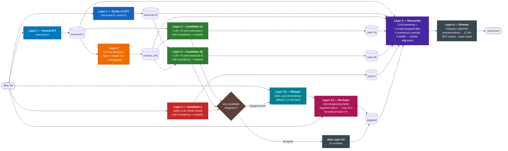
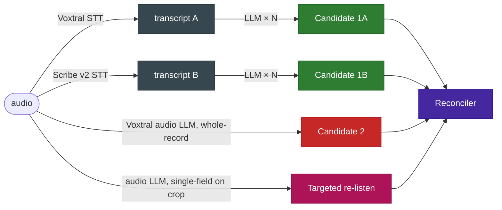
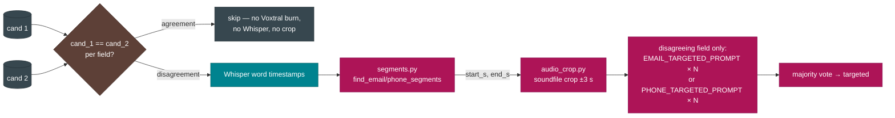
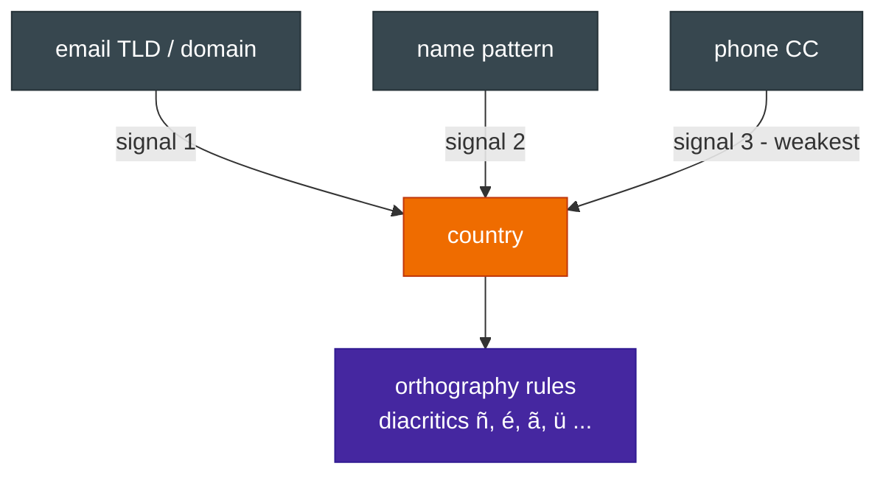
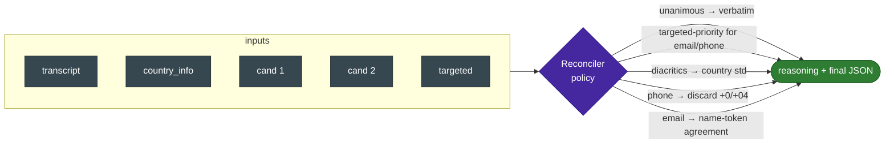
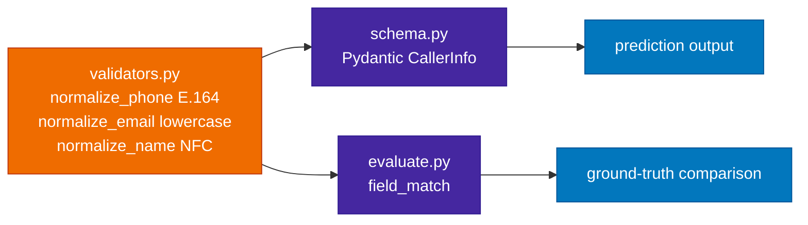
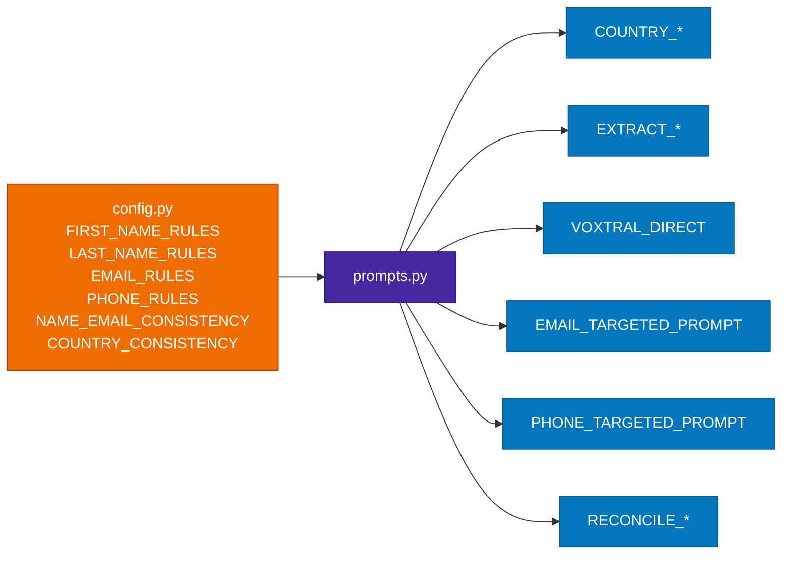

# Phonebot Pipeline

Extract `first_name`, `last_name`, `email`, `phone_number` from a German phone-call recording — robust to ASR errors, foreign-language names, dictated digits, spelled-out emails, and LLM stochasticity.

## The big idea

**Multiple STT models transcribe in parallel** (Voxtral + ElevenLabs Scribe), each transcript feeds an independent LLM-extraction candidate, an audio LLM produces a third candidate from the raw audio, and a **targeted re-listen** runs only when those candidates disagree on the difficult fields. A reasoning reconciler picks per key with three deterministic safety nets, and a Pydantic schema with `phonenumbers` normalises the final record.



## What's interesting

### 1. Multiple STTs + an audio LLM = uncorrelated errors



`TRANSCRIPTION_MODELS` in [src/config.py](src/config.py) is a **list**. Each STT model produces its own transcript, and Layer 3 derives an independent candidate from each. ASR errors are correlated within a single model and uncorrelated across models — adding Scribe alongside Voxtral is the cheapest accuracy lever in the pipeline.

- **Candidates 1A, 1B, …** (one per STT × LLM × N self-consistency runs) — strong on country/orthography, weak when ASR garbled a token. The set as a whole catches errors any single STT made.
- **Candidate 2** (audio-LLM, whole record) — strong on letters/digits the caller actually said, weak on origin-correct spelling.
- **Targeted re-listen** (audio-LLM, single field on cropped audio) — fires only when the candidates disagree on the field; uses Whisper word timestamps to crop the audio window with `Punkt`/`Bindestrich`/`ät` / dictated-digit indicators.

All four readings fail in different places. The reconciler exploits that, and three deterministic safety nets backstop it (next section).

### 2. Targeted re-listening — only on ambiguity

A human transcriptionist listens once, then **rewinds only the parts they're not sure about**. Layer 4.5 fires only on the fields where the whole-record candidates disagree — for unanimous keys we skip the entire layer (and the Whisper timestamper that feeds it).



How it works (per record):

1. **Gate** in [main.py](main.py): build `cand_1` and `cand_2` first; only if `cand_1[k] != cand_2[k]` for `email` or `phone_number` do we proceed. Most records agree → Layer 4.5 is skipped entirely.
2. **Timestamps** ([Layer 1b — Whisper](src/transcription.py)): word-level timestamps come from `whisper-large-v3-turbo` at fp32 (the fp16 path SIGILL'd in `SuppressTokensLogitsProcessor`). Whisper isn't called when the gate skipped the record.
3. **Detect** ([src/segments.py](src/segments.py)): `find_phone_segments` looks for sustained runs of digits / German digit-words (`null`, `eins`, `zwei`, …) and the `plus` / `vorwahl` markers. `find_email_segments` looks for `Punkt` / `Bindestrich` / `Unterstrich` / `ät` / domain hints (`gmail`, `gmx`, `de`, `com`) plus letter-by-letter spelling.
4. **Crop** ([src/audio_crop.py](src/audio_crop.py)): merged window widened with `TARGETED_PAD_SECONDS = 3` of context on each side; `soundfile` (no librosa, no numba) writes a temp WAV.
5. **Re-prompt**: the audio LLM gets ONLY that crop with a single-field prompt — and only for the disagreeing field. Other field's targeted re-listen records `mode: skipped_unanimous`.
6. **Vote**: `NUM_TARGETED_VOTES` runs, majority-voted.

The report records `mode: cropped | full_audio | skipped | skipped_unanimous` per field plus the `window_s` used, so you can audit every rewind.

**Two safety nets in [src/reconcile.py](src/reconcile.py):**

- `_filter_invalid_targeted` drops a targeted value before the reconciler sees it if it looks structurally broken (email without "@" + TLD; phone that doesn't parse).
- `_unanimous_override` runs **after** the LLM reconciler: if `cand_1 == cand_2` and non-empty, that value wins regardless of what the LLM picked. This stops a confident-but-wrong cropped guess (e.g. Voxtral hearing "uol" as "oul" on a tight crop) from overriding a correct consensus.

Why all of this matters: cropping was actively hurting accuracy when run unconditionally (26/30 vs 28/30) — Voxtral generates better with full audio context. Conditional cropping keeps the rewind benefit for the disagreement cases where it can actually help, without paying its cost on records where the candidates already agreed.

### 3. Country is decided once, not re-inferred



A dedicated layer maps `name heritage + email TLD/domain → linguistic-origin country`. That country is the authority for diacritics and orthography downstream. Deciding it once removes a class of "5 LLM runs picked 3 different countries" failures, and lets the prompts say "use *this* country's rules" instead of asking each run to re-derive them.

### 4. Four deterministic safety nets after the LLM reconciler

The reconciler is an LLM, so it can be charmed by a confident-wrong cropped audio guess, skip a textbook NAME ↔ EMAIL CONSISTENCY rule, or strip a diacritic that 2 of 3 candidates correctly produced. Four rules run in code, in a specific order, to guarantee the obvious cases.

```mermaid
flowchart LR
    s0[<b>0. _filter_invalid_targeted</b><br/>BEFORE the LLM<br/>drops targeted email/phone that<br/>fails is_valid_email_shape<br/>or phonenumbers.is_valid_number]
    s0 --> llm[LLM reconciler<br/>picks per key + reasoning]
    llm --> s1[<b>1. _unanimous_override</b><br/>if EVERY whole-record cand<br/>agrees on a key → that wins]
    s1 --> s2[<b>2. _majority_override</b><br/>if a STRICT majority of<br/>whole-record cands agrees<br/>(2 of 3, etc.) → that wins]
    s2 --> s3[<b>3. _email_name_alignment</b><br/>if names disagree AND ASCII<br/>forms also differ AND email's<br/>local-part has a token within<br/>edit-dist 2 of every cand →<br/>use email token]
    s3 --> out([final])

    classDef indigo fill:#4527a0,stroke:#311b92,color:#ffffff
    classDef teal   fill:#00838f,stroke:#006064,color:#ffffff
    classDef green  fill:#2e7d32,stroke:#1b5e20,color:#ffffff
    classDef red    fill:#c62828,stroke:#b71c1c,color:#ffffff
    class llm indigo
    class s0 teal
    class s1,s2,s3 green
```

**Net 0 — `_filter_invalid_targeted` (pre-LLM).** Targeted email must have `[^\s@]+@[^\s@]+\.[^\s@]+`; phone must pass `phonenumbers.is_valid_number(parse(...))`. Stops a truncated crop yielding `marie.lefevre@` (no domain) from sneaking in as "the strongest signal".

**Net 1 — `_unanimous_override`.** If every non-empty whole-record candidate (each `cand_1A`, `cand_1B`, … plus `cand_2`) agrees on a key, that value wins. Catches the case where the LLM was charmed by a targeted re-listen that disagreed with everything else.

**Net 2 — `_majority_override`** (the new one). If the whole-record candidates have a *strict* majority (more than half) on a key, that majority value wins. Concrete:

- **call_09 phone** — Voxtral and Scribe both transcribed `+4916277665544`; the audio LLM dropped a digit to `+491627765544`; the targeted re-listen echoed the audio LLM. The LLM trusted the targeted-priority rule and emitted the wrong value. `_majority_override` sees 2 vs 1 across the whole-record candidates and locks the right one.
- **call_26 email** — 2 of 3 candidates produced `ahmed.hassan@...`; Scribe's transcript-LLM produced `ahmid.hassan@...`; the targeted re-listen echoed Scribe. Same fix.
- **call_20 / call_29 last_name** — `García`/`García`/`Garcia` and `Martínez`/`Martínez`/`Martinez`. The accented form is a strict majority → it wins.

**Net 3 — `_email_name_alignment` — NAME ↔ EMAIL CONSISTENCY done deterministically.** When candidates disagree on a name field AND their **ASCII-folded** forms also differ (i.e. it's a real letter substitution, not a pure diacritic disagreement), scan the FINAL email's local-part for an alphabetic token within edit-distance 2 of every candidate spelling. If found, replace the name with that token (capitalised).

Two guards are critical:

- **ASCII-folded comparison.** Without this, "García"/"Garcia" both have edit-distance ≤ 2 from `garcia` in the email, and we'd strip the accent the majority override just put in.
- **ASCII-distinct guard.** If candidates' ASCII-folded forms are all the same, the disagreement is purely diacritic and the country-orthography rule (not the ASCII email) is the authority — so we skip alignment.

Worked example (call_25): final email = `marie.lefevre@yahoo.fr`; candidate last_names = `Lefebvre`, `Lefevre`, `Le Fèvre`. ASCII-folded: `lefebvre`, `lefevre`, `le fevre` — distinct. Edit distances to email-run `lefevre`: [1, 0, 1] — all ≤ 2. → `last_name = "Lefevre"`.

### 5. Reasoning-first reconciliation



The reconciler outputs a `reasoning` field next to the four caller-info keys — an audit trail explaining which input it picked and why per key. Regressions become debuggable instead of mysterious.

### 6. Shared normaliser for prediction AND evaluation



The same `validators.py` is used by **both** the prediction path (Layer 6 schema) and the evaluator (`field_match`). That guarantees `"+49 172 84492"` and `"+4917284492"` are byte-identical on both sides — the pipeline doesn't lose points to formatting variation, only to genuine extraction errors.

The evaluator also accepts list-valued ground-truth fields (`"first_name": ["Lisa Marie", "Lisa-Marie"]`) per the challenge spec.

### 7. Model-agnostic audio backends

`TRANSCRIPTION_MODELS` is a **list** — adding a second STT is one line in [src/config.py](src/config.py):

```python
TRANSCRIPTION_MODELS = [
    "voxtral:mistralai/Voxtral-Mini-3B-2507",
    "elevenlabs:scribe_v2",
]
INSTRUCT_MODEL    = "voxtral:mistralai/Voxtral-Mini-3B-2507"
TIMESTAMP_MODEL   = "whisper:openai/whisper-large-v3-turbo"   # Layer 1b fallback
```

`build_transcriber(spec)` / `build_instructor(spec)` / `build_timestamper(spec)` parse `<backend>:<model_id>`, dispatch to the matching backend class, and **cache instances** so a single Voxtral model is loaded at most once per process even when multiple roles share the spec. Asking ElevenLabs Scribe to follow audio instructions raises a clear error — the framework knows which roles each backend can fill.

### 8. Rules in `config.py`, prompts in `prompts.py`



Edit a rule once and it propagates to every layer that uses it — extraction, targeted re-listen, and reconciler — so the rules can't drift between layers.

### 9. Production-ready observability

Every run writes a timestamped report `results/report_YYYY-MM-DD_HHMMSS.json`. Per recording:

| Field | Why |
|---|---|
| `transcription`, `country_info`, `candidate_1`, `candidate_2`, `targeted`, `reasoning` | Full intermediate trace for debugging |
| `agreement` per key — `n_candidates`, `n_unique`, `unanimous` flag | Drift indicator: a fall in inter-model agreement signals model degradation before accuracy drops |
| `warnings` from Pydantic | Flags structurally-bad emails / unparseable phones |
| `timings` per layer (seconds) | Latency budget per stage for capacity planning |

Top-level `run` block:

| Field | Why |
|---|---|
| `prompt_version` | A/B comparisons can group runs by prompt version |
| `models.transcription / .instruct / .llm` | Reproducibility |
| `settings` (vote counts, USE_TARGETED_EXTRACTION, …) | Captures the experimental config |
| `evaluation` | Final per-key accuracy + mismatches list |

## Per-stage settings

| Stage | model | temp | runs | role |
|---|---|---|---|---|
| Layer 1 — transcription (list)   | Voxtral + ElevenLabs Scribe v2 | — | 1 each | one transcript per STT model; Scribe also returns word timestamps |
| Layer 1b — timestamps (lazy) | Whisper-large-v3-turbo (fp32) | — | conditional | fallback word timestamps for Layer 4.5 cropping when no STT provides them |
| Layer 2 — country         | gpt-5.4-mini   | 0     | 1 | linguistic origin |
| Layer 3 — candidate per transcript | gpt-5.4-mini | 0.7 | 5 per transcript | one independent candidate per STT model |
| Layer 4 — candidate 2     | Voxtral        | 0.01  | 3 | whole-record audio instruction-following |
| Layer 4.5 — re-listen     | Voxtral        | 0.01  | 3 per disagreeing field | conditional: only when any candidate disagrees on email/phone; segment crop ±3 s |
| Layer 5 — reconciler      | gpt-5.4-mini   | 0     | 1 | invalid-targeted filter (pre-LLM) → LLM pick → unanimous → strict-majority → name↔email alignment (ASCII-distinct guarded) |
| Layer 6 — schema          | Pydantic + phonenumbers | — | — | E.164 / NFC / lower-casing |

A/B switches in [src/config.py](src/config.py): `TRANSCRIPTION_MODELS` (list), `INSTRUCT_MODEL`, `TIMESTAMP_MODEL`, `NUM_LLM_VOTES`, `NUM_INSTRUCT_VOTES`, `NUM_TARGETED_VOTES`, `TARGETED_PAD_SECONDS`, `USE_TARGETED_EXTRACTION`, `VOXTRAL_ATTN_IMPL`, `DEFAULT_PHONE_REGION`, `PROMPT_VERSION`, `AUTO_RESUME`.

## Module map

| Module | Role |
|---|---|
| [src/transcription.py](src/transcription.py) | `Transcription{text, words?}`; Voxtral + ElevenLabs Scribe backends; factory |
| [src/segments.py](src/segments.py) | `find_email_segments`, `find_phone_segments` from word timestamps |
| [src/audio_crop.py](src/audio_crop.py) | `cropped_audio()` context manager — librosa load + soundfile write |
| [src/country.py](src/country.py) | Layer 2 |
| [src/extract_llm.py](src/extract_llm.py) | Layer 3 (candidate 1) |
| [src/extract_voxtral.py](src/extract_voxtral.py) | Layer 4 (candidate 2) |
| [src/targeted_extract.py](src/targeted_extract.py) | Layer 4.5 — segment detect → crop → re-prompt |
| [src/reconcile.py](src/reconcile.py) | Layer 5 |
| [src/schema.py](src/schema.py) | Layer 6 — Pydantic `CallerInfo` |
| [src/validators.py](src/validators.py) | shared by schema + evaluator |
| [src/evaluate.py](src/evaluate.py) | per-key normalised matching + GT-array support |
| [src/config.py](src/config.py) | rules + A/B knobs |
| [src/prompts.py](src/prompts.py) | composed prompts |
