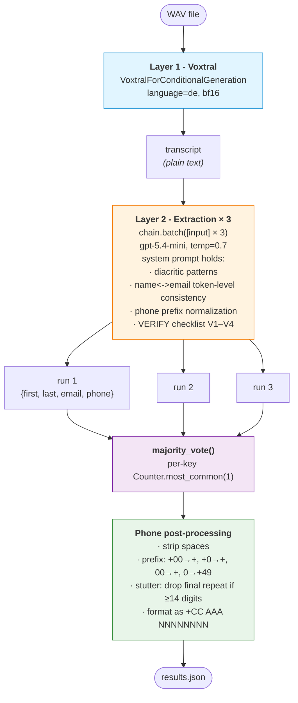
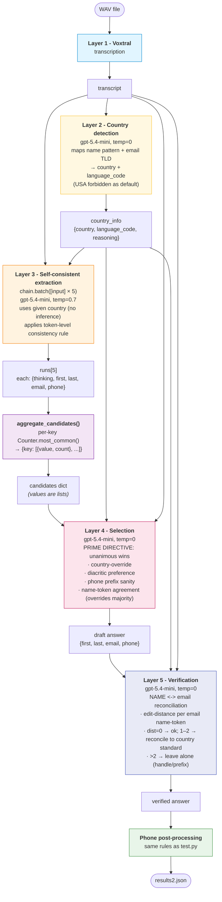

# Pipeline architectures

Two pipelines extract caller info (`first_name`, `last_name`, `email`, `phone_number`) from a German-language phone-call recording. Both use Voxtral-Mini-3B for transcription and `gpt-5.4-mini` via langchain for the structured-extraction stages.

## test.py - single-stage extraction with majority voting

Behaviour: a single LLM does origin inference + extraction + verification in one pass. Three runs are aggregated with naive per-key majority voting. The pipeline depends entirely on the extraction prompt to enforce all the rules; if a rule is silently dropped in 2 of 3 runs, the wrong answer wins.

## test2.py - five-layer pipeline with self-consistency, selection and verification

Differences from test.py:
- Country is decided **once** (Layer 2) and passed as input to all later layers, instead of being re-inferred 3× independently.
- Self-consistency runs are aggregated as **candidate lists with counts**, not collapsed by majority. Layer 4 sees the full distribution.
- Layer 4 is a dedicated **selection** step that can override majority (e.g., a 1-of-5 candidate with the right diacritics beats a 4-of-5 candidate without them).
- Layer 5 is a dedicated **verification** step that reconciles NAME <-> email when their letters are within edit-distance 2 - catches the case where extraction got one side right and the other side wrong.

## Per-stage settings

| Stage                | model         | temp | runs | output                                |
|----------------------|---------------|------|------|---------------------------------------|
| Voxtral (both)       | Voxtral-Mini-3B-2507 | -    | 1    | transcript                            |
| test.py extract      | gpt-5.4-mini  | 0.7  | 3    | full record (voted per-key)           |
| test2 country        | gpt-5.4-mini  | 0    | 1    | `{country, language_code, reasoning}` |
| test2 extract        | gpt-5.4-mini  | 0.7  | 5    | candidate list per key                |
| test2 select         | gpt-5.4-mini  | 0    | 1    | draft answer                          |
| test2 verify         | gpt-5.4-mini  | 0    | 1    | reconciled answer                     |
